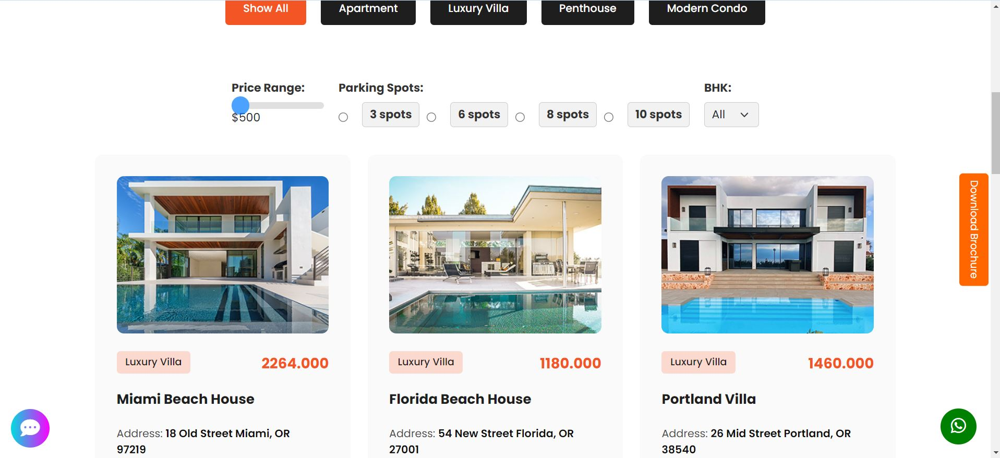
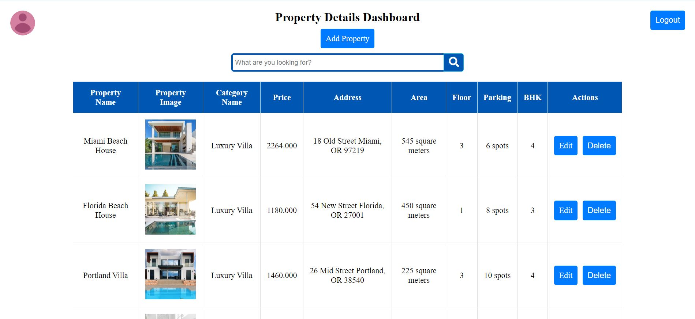

## Instructions
Download the zipped github folder of this project and unzip the folder in your computer system.
Open the project folder with command prompt and type 
```
composer update --no-scripts

```
After that create database and give the database a name.
Enter the project folder and rename the .env.example file to .env
Enter your correct database credentials in .env file.
Again open command prompt and type 
```
php artisan migrate

```
After that type 

```
php artisan serve

```

<br>
Remember everytime you download a laravel github folder, this way you should run the laravel app.
